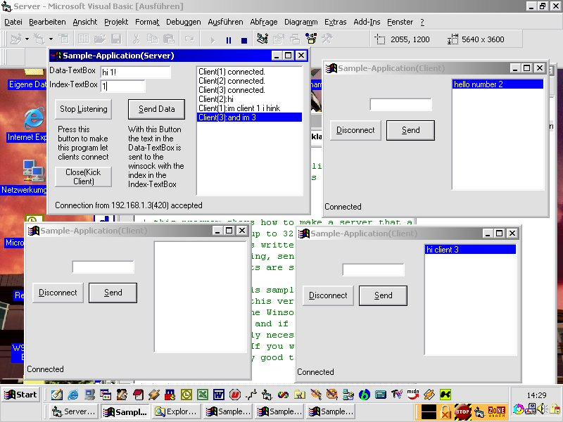



## Winsock control server accepting multiple connections

### Description

This is a sample on how to make a server accept multiple conections using an array of winsock controls (6.0 SP5). Well, not much more to say, just that I saw some others that arent as well coded :P

It does only work with version 6.0 and SP5 of the control (and above? :]) since there was a bug in SP4 so that you couldn't unload the control...
 
### More Info
 

             |
---                |---
**Submitted On**   |2002-03-17 20:21:58
**By**             |[ThFabba](https://github.com/Planet-Source-Code/PSCIndex/blob/master/ByAuthor/thfabba.md)
**Level**          |Intermediate
**User Rating**    |4.3 (13 globes from 3 users)
**Compatibility**  |VB 6\.0
**Category**       |[Internet/ HTML](https://github.com/Planet-Source-Code/PSCIndex/blob/master/ByCategory/internet-html__1-34.md)
**World**          |[Visual Basic](https://github.com/Planet-Source-Code/PSCIndex/blob/master/ByWorld/visual-basic.md)
**Archive File**   |[Winsock\_co64860323200\.zip](https://github.com/Planet-Source-Code/thfabba-winsock-control-server-accepting-multiple-connections__1-33001/archive/master.zip)

